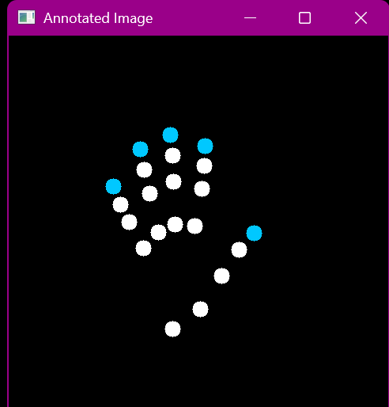
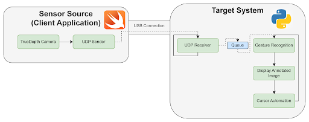
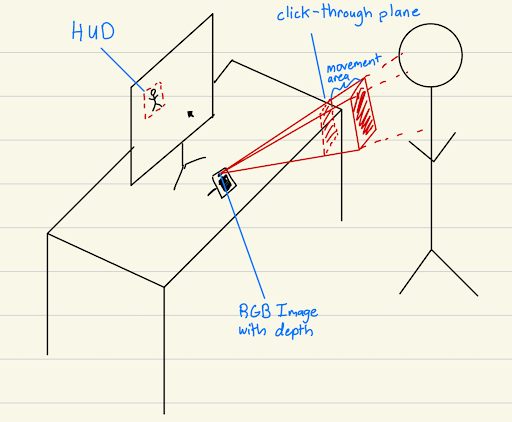
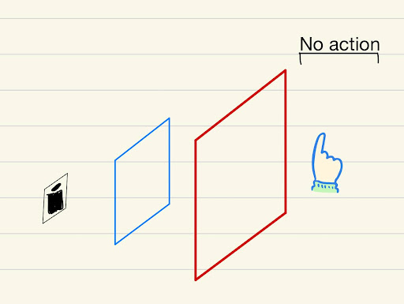
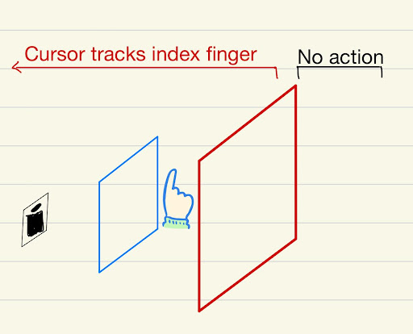
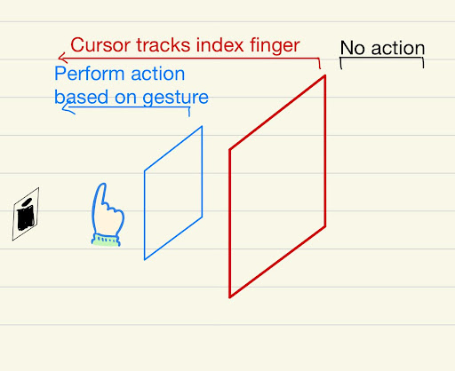

# Conjure

Welcome to Conjure, a controller-free system for controlling your computer! Requires an iPhone with FaceID.

## Features
<figure align="center">
  
  <figcaption> Conjure in action, running on-device. </figcaption>
</figure>

- Mouse movement according to hand position, controlled using the depth and RGB sensors in your front-facing phone camera
- Specific gestures to control common inputs ("index finger" for left click, "peace" for right click, "pinch" to click and drag)

<figure align="center">
  
  <figcaption> High level architecture. Certain modes may work wirelessly. </figcaption>
</figure>
<figure align="center">
  
  <figcaption> Mental model of the system. </figcaption>
</figure>
<figure align="center">
  
  
  
  <figcaption>System behaviour</figcaption>
</figure>

### Known Bugs/Future Features

- Add voice activation for speech-to-text typing
- Add a gesture-less mode, where only hand movements control the computer
- Rework configuration setup, allow configuration options to be stored between executions
- Add desktop GUI
  - Two-way communication between the phone and computer
  - Combine configuration GUI and camera feed. Overlay camera feed on top of other windows (or display the camera feed on the phone)
- Add application-specific controls to make use of depth information

## Usage

Upload the ios-client to your iPhone, set up a [Tailscale net](https://tailscale.com/) on both your phone and computer, and run the python server file on the computer you wish to control.

### Controls

Hand movement in the camera’s 2D projection of 3D space coincides with mouse movement across a computer’s monitor. Depth values relative to the camera's plane limit available actions. More details are available in the `docs`.

The following is a table detailing the correspondence between gestures and Conjure's actions:

| Area                | Gesture                                        | Action                                                      |
| ------------------- | ---------------------------------------------- | ----------------------------------------------------------- |
| Anywhere            | Palm / Stop                                    | Stop all movement                                           |
| Movement Plane      | One (pointing with index finger)               | Cursor tracks index finger movement precisely               |
|                     | Two-up (pointing with index and middle finger) | Cursor follows index finger movement with decaying velocity |
| Click-through Plane | One                                            | Mouse left-click                                            |
|                     | Peace                                          | Mouse right-click                                           |
|                     | OK (pinch)                                     | Mouse left-click and hold (for clicking+dragging)           |
